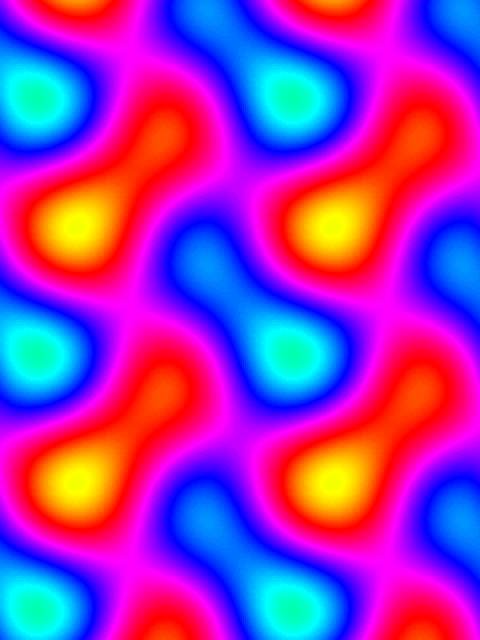
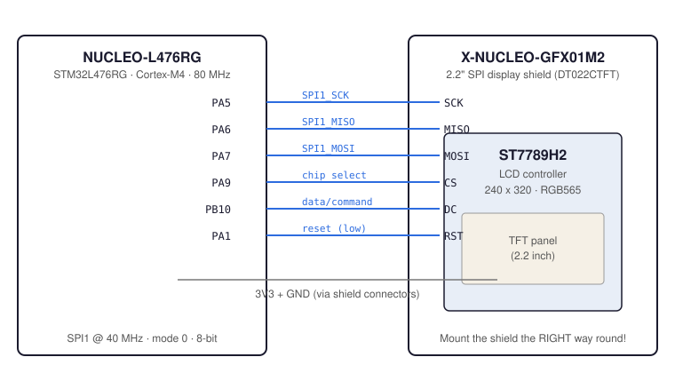

# NUCLEO-L476RG + X-NUCLEO-GFX01M2 — bare-metal graphics from scratch

A complete, beginner-friendly walkthrough of driving a **2.2" SPI TFT display
(X-NUCLEO-GFX01M2 shield)** from an **STM32 NUCLEO-L476RG** board — **without
any vendor libraries**: no HAL, no CubeMX, no RTOS. Just C, a compiler and the
reference manual.

The result is a real-time demo with two classic effects:

| Effect | What you see | Frame rate |
|---|---|---|
| **Plasma** | Four overlapping sine waves through a rotating rainbow palette | ~17 fps |
| **Starfield** | 200 stars flying towards the viewer (perspective warp) | ~30 fps |

 

> The previews above are rendered from the *exact same formulas* the firmware
> uses — what you see in the PNG is what the display shows.

---

## Table of contents

- [What you need](#what-you-need)
- [Quick start (5 minutes)](#quick-start-5-minutes)
- [The tutorial, step by step](#the-tutorial-step-by-step)
- [How it works](#how-it-works)
- [Pinout](#pinout)
- [Debugging](#debugging)
- [Troubleshooting](#troubleshooting)
- [Performance notes](#performance-notes)
- [Repository layout](#repository-layout)
- [Credits & license](#credits--license)

---

## What you need

### Hardware

| Part | Notes |
|---|---|
| [NUCLEO-L476RG](https://www.st.com/en/evaluation-tools/nucleo-l476rg.html) | any NUCLEO-64 would work, this repo targets the L476RG |
| [X-NUCLEO-GFX01M2](https://www.st.com/en/ecosystems/x-nucleo-gfx01m2.html) | display shield with a DT022CTFT (ST7789H2) 240×320 panel |
| USB cable | plugs into the **ST-LINK** connector, not the target USB |

### Software

- **Arm GNU Toolchain** (`arm-none-eabi-gcc`) — the cross-compiler
- **stlink tools** (`st-flash`) — flashing over the on-board ST-LINK
- **OpenOCD** + GDB — debugging (optional but recommended)
- `make`

Installation instructions for macOS and Linux:
[docs/01-toolchain-setup.md](docs/01-toolchain-setup.md)

---

## Quick start (5 minutes)

```bash
# 1. Plug the board into USB (the ST-LINK connector).

# 2. Verify the board is visible:
st-info --probe
#    Found 1 stlink programmers
#    version:    V2J41S27
#    chipid:     0x415          <- STM32L47x
#    dev-type:   STM32L47x_L48x

# 3. Mount the X-NUCLEO-GFX01M2 shield on the Arduino/morpho headers.
#    IMPORTANT: mount it the RIGHT way round (see Troubleshooting).

# 4. Build and flash:
cd firmware/main
make
make flash

# 5. Watch the show. Plasma for ~13 s, then the starfield, then it loops.
```

If `st-info --probe` shows `chipid: 0x000`, jump straight to
[docs/07-troubleshooting.md](docs/07-troubleshooting.md).

---

## The tutorial, step by step

For the full beginner path, read these in order:

1. [**Toolchain setup**](docs/01-toolchain-setup.md) — install the compiler
   and the flash tools on macOS/Linux
2. [**First connection**](docs/02-first-connection.md) — detect the board over
   USB and understand what the ST-LINK gives you (SWD + virtual COM port)
3. [**Hello world (blink)**](docs/03-hello-world.md) — the smallest possible
   program: startup code, linker script, a clock tree and an LED — flash it
   with `st-flash`
4. [**The display**](docs/04-display.md) — SPI in 15 minutes, the ST7789
   protocol (commands, data, windows), and bringing the panel up
5. [**The effects**](docs/05-effects.md) — plasma math without floats, the
   starfield projection, and the performance tricks (row precomputation,
   frame streaming)
6. [**Debugging**](docs/06-debugging.md) — OpenOCD + GDB: breakpoints, reading
   registers, memory dumps, and how we caught real bugs this way
7. [**Troubleshooting**](docs/07-troubleshooting.md) — every single problem we
   hit while building this project, with the fixes (this file alone can save
   you hours)

The documented firmware lives in [`firmware/main/`](firmware/main) — every file
is heavily commented. A minimal LED blink example lives in
[`firmware/blink/`](firmware/blink).

---

## How it works

```
HSI16 (16 MHz) ──> PLL ×10 ÷2 ──> 80 MHz core
                                      │
                 ┌────────────────────┤
                 ▼                    ▼
          SPI1 @ 40 MHz         USART2 @ 115200
          (PA5/6/7, APB2)       (PA2, VCP logs)
                 │
                 ▼
   ┌───────────────────────────────┐
   │  ST7789H2 LCD controller      │
   │  CS=PA9  DC=PB10  RST=PA1     │
   │  240×320, RGB565              │
   └───────────────────────────────┘
```

See [assets/architecture.svg](assets/architecture.svg) for the full diagram.

The whole demo is **~2.5 KB of code**. Highlights:

- **No FPU, no floats.** The plasma uses a 256-entry sine lookup table and
  integer arithmetic only.
- **One address window per frame.** `lcd_begin_frame()` sets the full-screen
  window once; `lcd_push()` then streams pixels with zero per-pixel command
  overhead; `lcd_end_frame()` drains the SPI and raises /CS.
- **Row precomputation.** Each plasma row is turned into final RGB565 colors
  *before* streaming, so the SPI bus never waits for math.
- **Pipelined SPI.** The transmit loop waits only for `TXE` (not `BSY`), which
  lets consecutive bytes pipeline at full bus speed.

---

## Mini-Mario — a playable game

Beyond the effects demo, this repository contains a complete little
platformer in [`game/`](game): tile-map levels, gravity and jumping,
enemy walkers (stomp them!), coins, a goal flag, three levels and a
full state machine (title → game → level clear → win / game over).

It demonstrates the *other* way to write embedded code: a layered
architecture where game logic never touches a hardware register
(see [game/README.md](game/README.md) for the architecture map and
tuning knobs).

```bash
cd game
make flash          # play: joystick LEFT/RIGHT moves, CENTER jumps
make scanflash      # diagnostic: find the joystick pins for any board
```

## Pinout

The shield routes the display through the Arduino/morpho connectors. On the
NUCLEO-L476RG the signals land on these pins:

| Signal | MCU pin | Role |
|---|---|---|
| SPI1_SCK  | **PA5**  | clock |
| SPI1_MISO | **PA6**  | data from display (unused, wired anyway) |
| SPI1_MOSI | **PA7**  | data to display |
| CS        | **PA9**  | chip select, active low |
| DC        | **PB10** | data/command (0 = command, 1 = data) |
| RST       | **PA1**  | panel reset, active low |



> ⚠️ **This pinout is for the L476RG.** The same shield maps to different pins
> on other NUCLEO boards — check UM2750 ("SPI display expansion boards for
> STM32 Nucleo-64") for your board.

---

## Debugging

The board's ST-LINK gives you SWD debugging and flashing through one USB
cable:

```bash
# terminal 1: start the debug server
openocd -f interface/stlink.cfg -f target/stm32l4x.cfg

# terminal 2: connect GDB
arm-none-eabi-gdb demo.elf
(gdb) target extended-remote :3333
(gdb) monitor reset halt
(gdb) break main
(gdb) continue
```

Full walkthrough: [docs/06-debugging.md](docs/06-debugging.md).

---

## Troubleshooting

The short version of the lessons learned (details in
[docs/07-troubleshooting.md](docs/07-troubleshooting.md)):

1. **`Failed to enter SWD mode` while the target voltage reads fine**
   → the GFX01M2 shield is mounted **the wrong way round**. Mounted
   correctly, SWD works normally with the shield on.
2. **`st-flash` succeeds but the old program still runs**
   → `st-flash` does **not** reset the target. Run `st-flash reset`
   (the repo's `make flash` does it for you).
3. **Code runs but everything is ~12× slower than expected**
   → on some L476RGs the MSI range switch silently fails and the core
   stays at 4 MHz. Use HSI16 + PLL (this repo does).
4. **First writes to a freshly clocked peripheral get lost**
   → insert `dsb` + a dummy read after enabling the peripheral clock
   (the repo's `rcc_sync()`).
5. **Text on the display is mirrored** → flip the `MX` bit in the
   `MADCTL` register (this repo uses `0x08`).

---

## Performance notes

Full-screen software rendering over SPI is a nice exercise in pipelining:

| Stage | What changed | Effect |
|---|---|---|
| v1 | MSI 48 MHz target, SPI /8, per-pixel windows, BSY wait per byte | 0.5 fps |
| v2 | HSI16+PLL 80 MHz (fixed the real clock), SPI /2 | 6.5 fps |
| v3 | row precomputation + inline pixel push | 8 fps |
| v4 | removed per-byte BSY wait (pipelined), full-row color precompute | **~17 fps** |

The SPI link (40 MHz) is now the main limiter — the plasma frame streams
153,600 bytes in ~31 ms; the remaining ~29 ms are pixel math.

---

## Repository layout

```
.
├── README.md                    ← you are here
├── docs/                        ← the tutorial chapters
│   ├── 01-toolchain-setup.md
│   ├── 02-first-connection.md
│   ├── 03-hello-world.md
│   ├── 04-display.md
│   ├── 05-effects.md
│   ├── 06-debugging.md
│   └── 07-troubleshooting.md
├── firmware/
│   ├── main/                    ← the plasma + starfield demo
│   │   ├── main.c               ← clocks, GPIO, SPI, UART
│   │   ├── st7789.c/.h          ← LCD driver (init, windows, text, streaming)
│   │   ├── fx.c/.h              ← plasma + starfield effects
│   │   ├── font5x7.c/.h         ← 5x7 bitmap font
│   │   ├── regs.h               ← minimal register definitions
│   │   ├── startup_l476.s       ← vector table + reset handler
│   │   ├── linker.ld            ← memory layout
│   │   └── Makefile
│   └── blink/                   ← minimal LED blink (hello world)
├── tools/
│   └── uart_cat.py              ← read the VCP at a fixed baud rate
└── assets/
    ├── architecture.svg
    ├── pinout-nucleo-gfx01m2.svg
    ├── preview-plasma.png
    └── preview-starfield.png
```

---

## Credits & license

- The ST7789 power-up sequence and the 5×7 font were validated against
  [KennethGHansen/Nucleo-F446RE_X-Nucleo-GFX01M2](https://github.com/KennethGHansen/Nucleo-F446RE_X-Nucleo-GFX01M2)
  and the shield pinout against
  [ludarus/STMDisplay-GFX01M2](https://github.com/ludarus/STMDisplay-GFX01M2).
- Everything else was written from scratch against RM0351 (STM32L4 reference
  manual) and the ST7789H2 datasheet.

Licensed under the [MIT License](LICENSE) — use it, learn from it, build on it.
